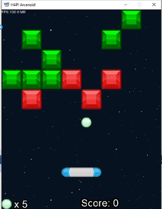
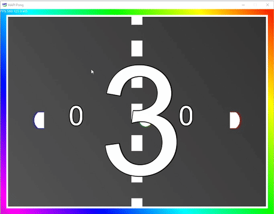

# C++ Games Engine Construction
2D Game Engine and 4 demo projects to show it off built in C++ using the HAPI framework by Keith Ditchburn as part of the Games Engine Construction module of Year 2 BSc Computer Games Programming at Teesside University. 

Every demo project created for this module can be downloaded as .exe's from the _Releases_ tab of this repo

# Nano's Adventure
Nano's Adventure is a 2D Platformer, inspired by the original arcade Mario game, created as the main demo and final project for the module. In the game, you play as Nano, a small green alien, as he runs and jumps across 3 different levels, collecting coins, power-ups and squashing enemies along the way. Developed over a month using the game engine, Nano's Adventure was really fun to work on, teaching me a lot about platformer mechanics and working on a larger-scale C++ Project.

# Arkanoid
As the module progressed, we had several milestones that our game engines had to meet. I created Arkanoid to meet the requirements of the Third milestone. The requirements for this milestone are to create functionality that can clip textures to the edges of the screen so that a texture can be drawn partially off the screen, optimised code for situations where the texture is completely off the
screen or completely on the screen, a texture with the ability to be moved using an Xbox controller, and to have lots of the same graphics in different positions.

I met and exceeded the requirements for this milestone, also adding basic animation support and the ability to load a spritesheet into the black-boxed graphics system.

# Pong
The requirements for the second milestone were, can load _.tga_ textures, displays a user error in case of a missing texture, draw textures to any position on the screen, handle transparency, run at interactive frame rates, and to handle keyboard input. To meet these requirements a simple Pong game was created. Every texture has transparency and displays correctly, blending with the background textures. 

